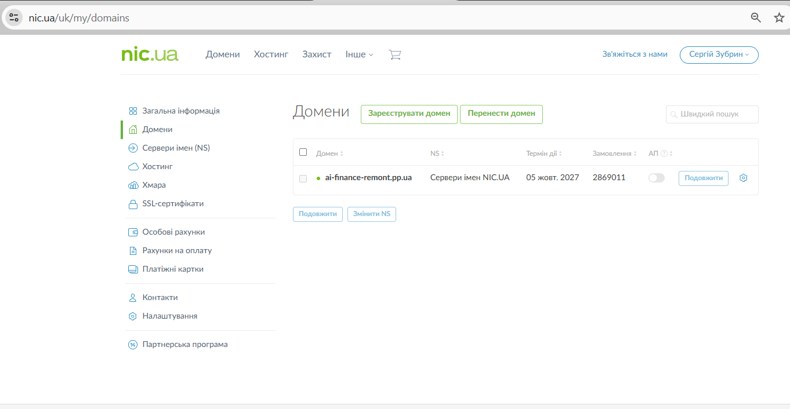
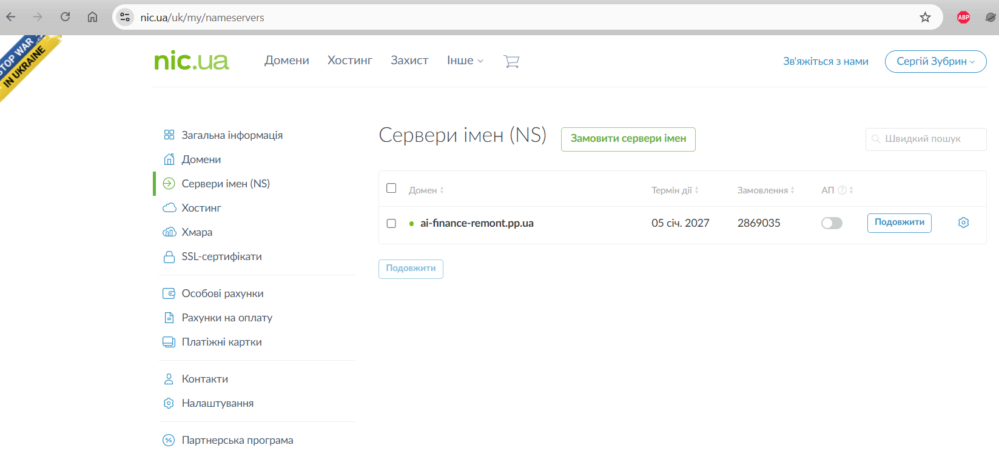
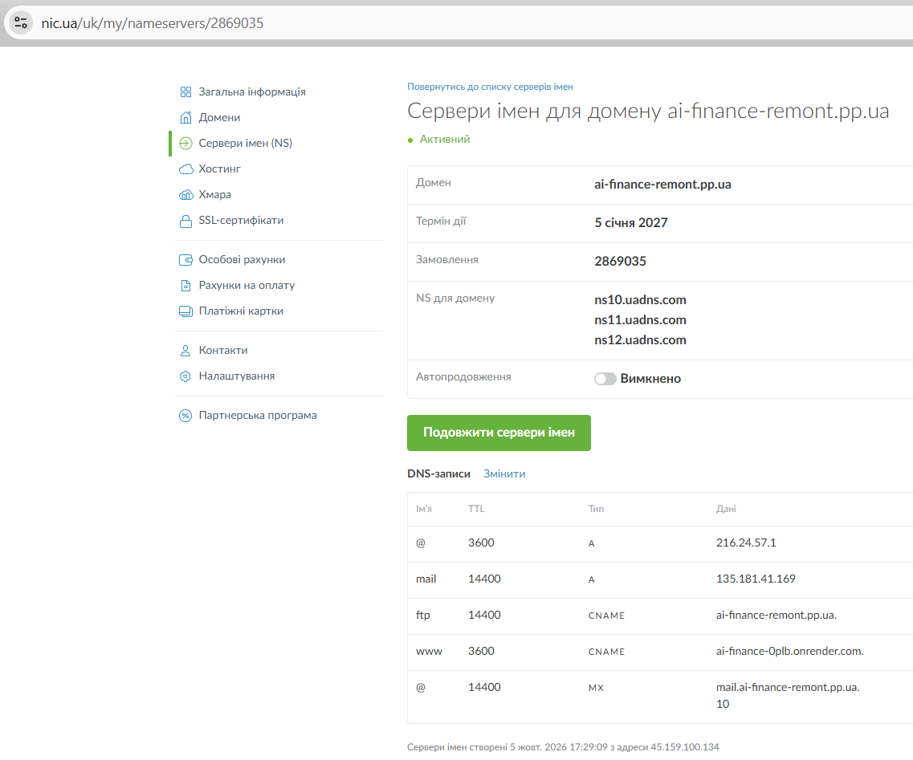
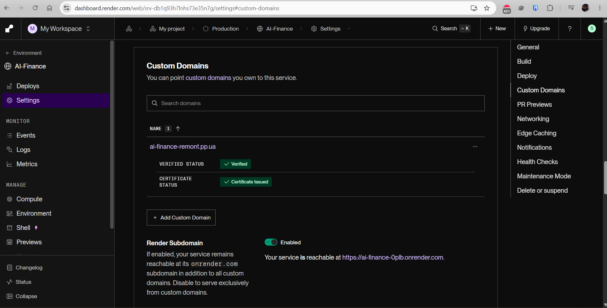
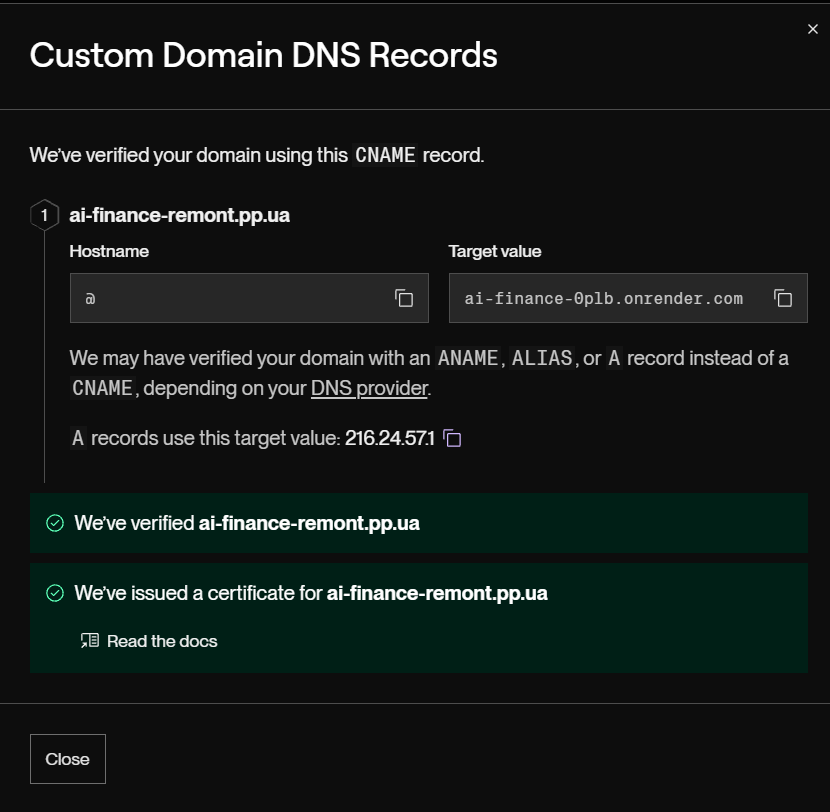
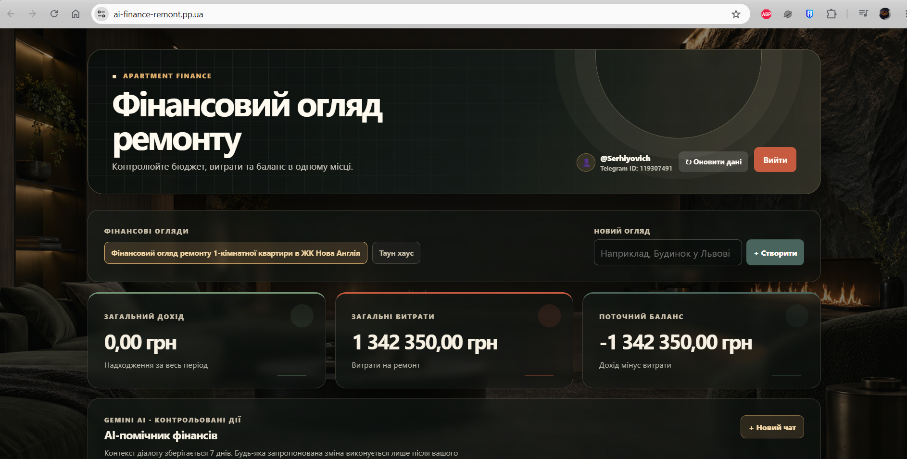

# Налаштування власного домену

## Адреси сервісу

- Технічний URL Render: `https://ai-finance-0plb.onrender.com`
- Власний домен: `ai-finance-remont.pp.ua`
- Додатковий піддомен: `www.ai-finance-remont.pp.ua`

## Скріншоти

### Домен у NIC.UA



### NS-сервери та DNS-записи





### Custom Domain у Render





### SaaS за власним доменом



## DNS-сервери

У NIC.UA для домену налаштовано такі NS-сервери:

- `ns10.uadns.com`
- `ns11.uadns.com`
- `ns12.uadns.com`

Попередня делегація на `parked1.uadns.com` і `parked2.uadns.com` була причиною проблеми з верифікацією. Після зміни NS потрібно дочекатися її поширення в публічному DNS.

## DNS-записи

| Ім'я | TTL | Тип | Значення | Призначення |
| --- | ---: | --- | --- | --- |
| `@` | 3600 | `A` | `216.24.57.1` | Кореневий домен на балансувальник Render. |
| `www` | 3600 | `CNAME` | `ai-finance-0plb.onrender.com.` | Піддомен `www` на Render Web Service. Крапка наприкінці важлива: це повне доменне ім'я. |
| `mail` | 14400 | `A` | `135.181.41.169` | Поштовий сервер; не пов'язаний із Render. |
| `ftp` | 14400 | `CNAME` | `ai-finance-remont.pp.ua.` | Наявний FTP-псевдонім. |
| `@` | 14400 | `MX` (priority 10) | `mail.ai-finance-remont.pp.ua.` | Наявний поштовий маршрут. |

Для кореневого домену цей DNS-провайдер використовує `A` запис, а не `CNAME`: Render вказує `216.24.57.1` як ціль для такого випадку.

## Перевірка DNS

Під час діагностики записи перевірялися через публічні резолвери Cloudflare і Google та безпосередньо через авторитетний NS:

```powershell
Resolve-DnsName ai-finance-remont.pp.ua -Type A -Server 1.1.1.1
Resolve-DnsName ai-finance-remont.pp.ua -Type A -Server 8.8.8.8
Resolve-DnsName ai-finance-remont.pp.ua -Type NS -Server 1.1.1.1
Resolve-DnsName ai-finance-remont.pp.ua -Type A -Server ns10.uadns.com
```

Очікувані результати: публічний DNS повертає NS `ns10/ns11/ns12.uadns.com`, а `A` запис кореневого домену — `216.24.57.1`.

## HTTPS і статус верифікації

Власний домен успішно верифіковано в Render: **Verified**. Render випустив TLS-сертифікат: **Certificate Issued**. HTTPS для `https://ai-finance-remont.pp.ua` працює.

Після верифікації перевірено:

```text
https://ai-finance-remont.pp.ua
https://www.ai-finance-remont.pp.ua
https://ai-finance-remont.pp.ua/health
```

SaaS успішно відкривається за `https://ai-finance-remont.pp.ua`. Endpoint `/health` має повертати `200` і `{"status":"ok"}`.

## Виявлені проблеми та виправлення

1. Render не зміг верифікувати домен.
   - Публічні резолвери використовували паркові NS `parked1.uadns.com` і `parked2.uadns.com`, які повертали стару адресу `135.181.41.169` для кореневого домену.
   - DNS-зона NIC.UA вже містила правильний `A` запис `216.24.57.1`, але не була делегована для домену.
   - Виправлення: у NIC.UA домен переключено з «Парковий NS» на `ns10.uadns.com`, `ns11.uadns.com` і `ns12.uadns.com`. Після поширення нової NS-делегації Render успішно верифікував домен і випустив сертифікат.

2. `www` спочатку був `A` записом на старий сервер `135.181.41.169`.
   - Виправлення: його замінено на `CNAME` до `ai-finance-0plb.onrender.com.`.

3. Під час першого введення CNAME DNS-панель дописала домен зони до цілі.
   - Некоректна ціль: `ai-finance-0plb.onrender.com.ai-finance-remont.pp.ua`.
   - Виправлення: ціль введено з фінальною крапкою — `ai-finance-0plb.onrender.com.`.

4. Особливості `AAAA` і `CAA`.
   - Для домену не потрібно створювати `AAAA` запис: Render очікує IPv4 і `AAAA` може заважати маршрутизації.
   - Якщо в зоні колись з'являться `CAA` записи, вони повинні дозволяти `letsencrypt.org` і `pki.goog`, інакше Render не зможе випустити TLS-сертифікат.

## Обмеження Free Render

На безкоштовному плані Render Web Service:

- зупиняється після 15 хвилин без вхідних HTTP або WebSocket-запитів;
- запускається знову від наступного HTTP-запиту, що створює холодний старт;
- зупиняє разом із Web Service Telegram-бота, оскільки вони працюють в одному контейнері;
- має 750 безкоштовних instance-hours на workspace щомісяця; після вичерпання ліміту безкоштовні Web Services призупиняються до наступного місяця;
- використовує тимчасову файлову систему: локальні файли губляться під час deploy, restart або spin-down;
- може бути перезапущений Render у будь-який момент.

Для постійно активного сайту й Telegram-бота потрібен платний Compute Plan. Дані застосунку мають зберігатися в Neon, а не у файловій системі контейнера.
